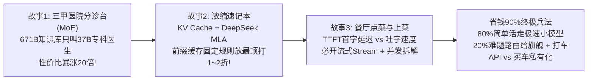

# 第 03 课：AI 应用工程师怎么挑模型省 90% 钱？MoE、KV缓存、速度与选型指南

```mermaid
flowchart LR
    A["故事1: 三甲医院分诊台(MoE)<br/>671B知识库只叫37B专科医生<br/>性价比暴涨20倍!"] --> B["故事2: 浓缩速记本<br/>KV Cache + DeepSeek MLA<br/>前缀缓存固定规则放最顶打1~2折!"]
    B --> C["故事3: 餐厅点菜与上菜<br/>TTFT首字延迟 vs 吐字速度<br/>必开流式Stream + 并发拆解"]
    C --> D["省钱90%终极兵法<br/>80%简单活走极速小模型<br/>20%难题路由给旗舰 + 打车API vs 买车私有化"]
```
