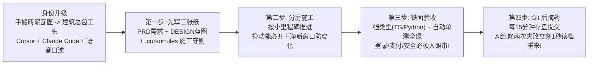

# 第 04 课：彻底告别手敲代码！Vibe Coding 实战心法（零基础做出上线级产品）

```mermaid
flowchart LR
    A["身份升级<br/>手搬砖泥瓦匠 -> 建筑总包工头<br/>Cursor + Claude Code + 语音口述"] --> B["第一步: 先写三张纸<br/>PRD需求 + DESIGN蓝图<br/>+ .cursorrules 施工守则"]
    B --> C["第二步: 分房施工<br/>按小里程碑推进<br/>换功能必开干净新窗口防腐化"]
    C --> D["第三步: 铁面验收<br/>强类型(TS/Python) + 自动单测全绿<br/>登录/支付/安全必须人眼审!"]
    D --> E["第四步: Git 后悔药<br/>每15分钟存盘提交<br/>AI连修两次失败立刻1秒读档重来!"]
```

## 📋 直接复制到项目根目录的 `.cursorrules` 黄金施工守则模板
见同目录 [cursorrules_template.txt](./cursorrules_template.txt)！
